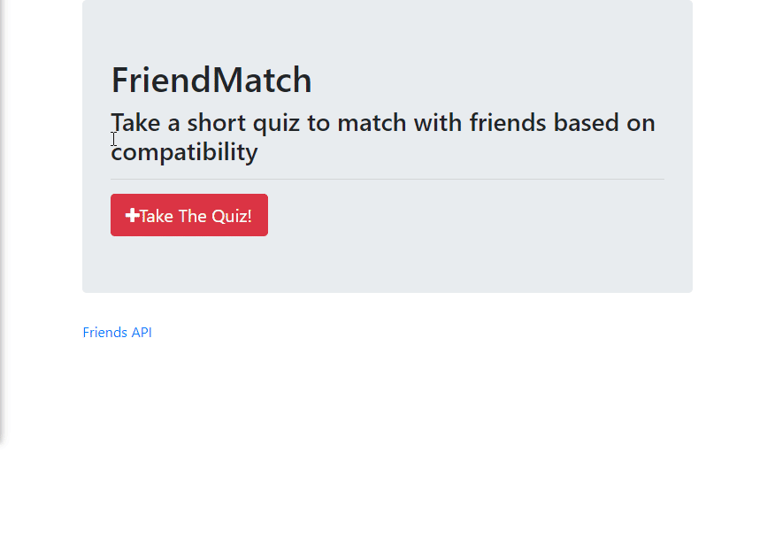

# friendmatch

Friendmatch is an app that takes in a user's answers to a survey and saves them in an object in an Array. Then a request is made to all of our existing user objects in our storage array, and calculates the average difference in answer numbers in relation to the user who just submitted their answers. The user is then matched to the existing entry with the lowest average differences in their answers.

